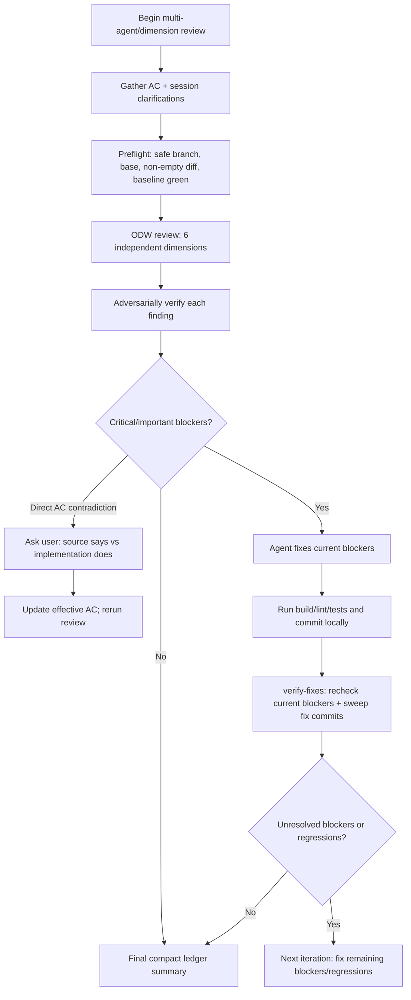

# review-until-clean-odw

Portable pre-PR review loop for [Open Dynamic Workflows (ODW)](https://github.com/xz1220/open-dynamic-workflows).

- `workflows/review-and-correct.js` is the executable review engine: fan out independent reviewers, adversarially verify findings, sweep fix regressions, and return structured JSON + concise markdown.
- `skills/review-until-clean/SKILL.md` is the host-agent operating procedure: safety gates, run workflow, fix with native tools, test, local commit, verify fixes, carry a compact ledger, and report the final result.

ODW brings Claude Code-style dynamic workflows -- JavaScript-orchestrated subagent fan-out with structured results -- to other agent harnesses, so this repo can use one executable review engine from Codex/Cursor/Claude-style workflows.

## Key rule

This workflow reviews a git diff. Reviewer agents must see `.git`.

Create an ODW config:

```json
{ "workspaceMode": "inplace" }
```

Use it for this workflow. ODW default copy mode may strip `.git` and produce unanchored findings.

If this is empty, stop; there is nothing branch-local to review:

```bash
git diff --name-only <base>...HEAD
```

## Why a workflow and a skill?

A skill can document the loop, but it cannot enforce the review topology. The workflow JS makes the review repeatable:

- runs the same six independent review dimensions every time
- adversarially verifies each finding instead of trusting first-pass reviewer prose
- returns stable fields (`confirmed[]`, `addressed[]`, `unresolved[]`, `regressions[]`) that the loop can act on
- checks fix commits for regressions with `priorHead...head`
- keeps reviewer transcripts out of the host agent context; the host carries only current blockers plus a compact ledger

The split is intentional:

- workflow: executable review engine
- skill: orchestration, state discipline, and final reporting

Two skills would document the same intent, but the orchestrating agent would have to recreate fan-out, verification, regression sweeps, and result shaping by hand on every run.

## Process outline



State stays small: full detail only for current blockers; resolved history becomes ledger lines from `addressed[]`. User-approved deviations from AC/plan/docs are folded into the effective AC and summarized at the end.

## Install

```bash
mkdir -p ~/.odw/workflows ~/.agents/skills
cp workflows/review-and-correct.js ~/.odw/workflows/review-and-correct.js
cp -R skills/review-until-clean ~/.agents/skills/review-until-clean
```

Optional agent links:

```bash
mkdir -p ~/.codex/skills ~/.cursor/skills
ln -sfn ~/.agents/skills/review-until-clean ~/.codex/skills/review-until-clean
ln -sfn ~/.agents/skills/review-until-clean ~/.cursor/skills/review-until-clean
```

## Run one review

Prefer `--args @file.json` for multiline AC.

```bash
odw run review-and-correct \
  --wait \
  --config odw-inplace-config.json \
  --source /path/to/repo \
  --args '{
    "ticketKey": "ENG-1234",
    "base": "origin/develop",
    "head": "HEAD",
    "ac": "<acceptance criteria text>",
    "mode": "review"
  }'
```

## Run until clean

Ask an agent with the skill installed:

```text
Use review-until-clean on this branch for ticket ENG-1234 against origin/develop. AC: ...
```

Loop policy:

1. Feature branch only. Never push.
2. Non-empty `<base>...HEAD` diff only.
3. Baseline build/lint/tests green.
4. Run ODW review with `workspaceMode: "inplace"`.
5. Fix critical/important findings only; minors do not force another round.
6. Run verification, commit locally once per round.
7. Re-run with `mode: "verify-fixes"`, current round blockers as `priorFindings`, and pre-fix HEAD.
8. Stop when no critical/important unresolved findings or regressions remain.

## Result contract

Review mode returns:

```text
confirmed[]  verified real/in-scope findings
clusters[]   shared-locus annotations; duplicates are cross-linked, not merged
dropped[]    false positives or out-of-scope findings rejected by verification
report       concise markdown summary
```

Verify-fixes mode returns:

```text
addressed[]    compact ledger input for resolved current-round blockers
resolved[]     full details for current blockers verified as fixed
unresolved[]   full details for current blockers still open
regressions[]  new verified findings in the fix commits
report         concise markdown summary
```

Findings are expected to be anchored to changed files/hunks. The workflow reviews an empty diff as clean.
