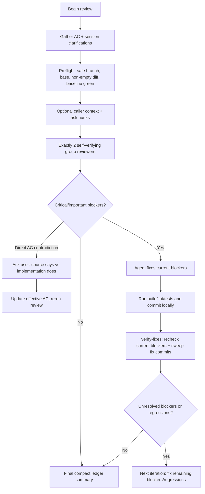

# review-until-clean-odw

Portable pre-PR review loop skill and Claude Code-compatible dynamic workflow, runnable in Claude Code and via [Open Dynamic Workflows (ODW)](https://github.com/xz1220/open-dynamic-workflows) for other harnesses.

- `workflows/review-and-correct.js` is the executable Claude Code-compatible workflow: exactly two independent reviewers each review and adversarially verify one wide concern group, then return structured JSON and concise markdown.
- `skills/review-until-clean/SKILL.md` is the host-agent operating procedure: safety gates, workflow invocation, fixes, tests, local commits, compact loop state, and final reporting.

Use the native `Workflow` tool when the host session is Claude Code — it runs dynamic workflows natively and needs nothing else. Every other harness (Oh My Pi, Codex, Cursor, …) runs the same script through ODW; a `claude` executable on `PATH` does not expose the `Workflow` tool to a non-Claude host.

## At a glance

The workflow reviews the branch diff against the effective acceptance criteria and local repository patterns across six sub-dimensions, grouped into two wide-scope reviewer passes:

| Group                      | Sub-dimensions                     | What it checks                                                                                                                                                                                                                                                                 |
| -------------------------- | ---------------------------------- | ------------------------------------------------------------------------------------------------------------------------------------------------------------------------------------------------------------------------------------------------------------------------------ |
| Behavior (runtime + tests) | Correctness, error handling, tests | Logic/control-flow bugs, AC compliance, ordering, state consistency after partial failures; swallowed or over-broad error handling, missing operator context in logs; AC coverage, meaningful assertions, failure/boundary cases                                               |
| Structure (design + docs)  | Design, conventions, docs          | Architecture, ownership, data flow, boundaries, reuse of existing mechanisms, lifecycle/API contracts, material scope changes; repo naming/placement/export/comment conventions; accuracy of touched docs, runbooks, comments, commands, paths, and referenced schemas or data |

Caller-supplied `codegraphContext` and `riskHunks` are optional accelerants. When omitted, both reviewers derive the context needed for their own concern group from the live diff; the workflow does not spawn a separate Orient agent.

Exactly two reviewer agents run independently in parallel. Each reviewer generates candidates, adversarially challenges them against the diff and acceptance criteria, runs cheap behavioral verification when safe, and returns candidate verdicts from that same session. Review mode therefore makes exactly two `agent()` calls rather than two reviewers plus one verifier per finding.

If either reviewer fails or returns an invalid result, the workflow fails instead of reporting a false clean review.

In `verify-fixes` mode, the same two groups each recheck their assigned prior findings and review `priorHead...head` for regressions in one session. The host agent fixes critical/important blockers, runs repository checks, commits locally, and repeats until no blockers or regressions remain.

The workflow is read-only. The host skill owns branch safety, edits, tests, local commits, loop state, and final reporting.

## Key rules

**Reviewer agents need real tools.** They run `git diff` and read the touched files themselves. An adapter with tools disabled does not error — it hallucinates a review. ODW's built-in `omp` adapter ships `--no-tools`; override it (see [Run one review](#run-one-review)). `codex`, `claude`, `cursor`, `kilo`, `opencode`, `gemini`, `qwen`, and `kimi` are tool-capable as shipped.

**Reviewer agents must see the live working tree.** ODW runs agents in place in `--source` by default, which is exactly right here. Never request `isolation: "worktree"` for this workflow: a worktree is a clean checkout of the base commit and hides uncommitted branch state. (`workspaceMode` is no longer an ODW config key; a config containing it is ignored with a warning.)

**No diff, no review.** If this is empty, stop; there is nothing branch-local to review:

```bash
git diff --name-only <base>...HEAD
```

## Why a workflow and a skill?

A skill can document the loop, but it cannot enforce the review topology. The workflow JS makes the review repeatable:

- runs exactly two wide-scope reviewer agents per invocation
- has each reviewer adversarially verify its own candidates instead of spawning per-finding verifier agents
- rechecks prior findings and scans fix regressions within the same two group sessions
- accepts optional caller-built context without requiring Codegraph or a separate Orient session
- returns stable fields (`confirmed[]`, `addressed[]`, `unresolved[]`, `regressions[]`) that the loop can act on
- keeps reviewer transcripts out of the host context; the host carries current blockers plus a compact ledger

The split is intentional:

- workflow: executable review engine
- skill: orchestration, state discipline, and final reporting

Two skills would document the same intent, but the orchestrating agent would have to recreate fan-out, verification, regression sweeps, and result shaping by hand on every run.

## Process outline


```mermaid
flowchart TB
  S[Begin review] --> A[Gather AC + session clarifications]
  A --> B[Preflight: safe branch, base, non-empty diff, baseline green]
  B --> C[Optional caller context + risk hunks]
  C --> D[Exactly 2 self-verifying group reviewers]
  D --> E{Critical/important blockers?}
  E -- No --> Z[Final compact ledger summary]
  E -- Direct AC contradiction --> H[Ask user: source says vs implementation does]
  H --> H2[Update effective AC; rerun review]
  E -- Yes --> F[Agent fixes current blockers]
  F --> G[Run build/lint/tests and commit locally]
  G --> I[verify-fixes: recheck current blockers + sweep fix commits]
  I --> J{Unresolved blockers or regressions?}
  J -- Yes --> K[Next iteration: fix remaining blockers/regressions]
  J -- No --> Z
```

State stays small: full detail only for current blockers; resolved history becomes ledger lines from `addressed[]`. User-approved deviations from AC/plan/docs are folded into the effective AC and summarized at the end.

## Install

Cross-platform installer (Windows/macOS/Linux; copies by default, no symlink privileges required):

```bash
node scripts/install.mjs
```

PowerShell:

```powershell
node .\scripts\install.mjs
```

The installer writes:

- ODW workflow copy: `~/.odw/workflows/review-and-correct.js`
- Claude Code workflow copy: `~/.claude/workflows/review-and-correct.js` (so Claude Code's workflow tool resolves it by `scriptPath`; skipped with `--no-harness`)
- `~/.agents/skills/review-until-clean`
- ODW review config: `~/.odw/review-config.json` (tool-capable `omp` adapter + a longer per-agent timeout; an existing file is never overwritten)
- common harness skill copies: `~/.codex/skills`, `~/.claude/skills`, `~/.cursor/skills`

Options:

```bash
node scripts/install.mjs --dry-run
node scripts/install.mjs --link
node scripts/install.mjs --no-harness
node scripts/install.mjs --harness-dir ~/.my-agent/skills
```

Manual fallback:

```bash
# ODW + shared skill
mkdir -p ~/.odw/workflows ~/.agents/skills
cp workflows/review-and-correct.js ~/.odw/workflows/review-and-correct.js
cp -R skills/review-until-clean ~/.agents/skills/review-until-clean
cp config/odw-review-config.json ~/.odw/review-config.json

# Claude Code (workflow by scriptPath + skill)
mkdir -p ~/.claude/workflows ~/.claude/skills
cp workflows/review-and-correct.js ~/.claude/workflows/review-and-correct.js
cp -R skills/review-until-clean ~/.claude/skills/review-until-clean
```

## Run one review

The same engine runs in either harness with identical `args`.

### Claude Code (native)

Invoke the workflow tool by `scriptPath`, passing `args` as a real JSON object:

```
Workflow({
  scriptPath: "~/.claude/workflows/review-and-correct.js",
  args: {
    ticketKey: "ENG-1234",
    base: "origin/develop",
    head: "HEAD",
    ac: "<acceptance criteria text>",
    mode: "review"
  }
})
```

`~/.claude/workflows/` is not scanned by the named-workflow registry, so invoke by `scriptPath`, not by name. This native path applies when the active host is Claude Code; merely having `claude` on PATH in another harness does not make its `Workflow` tool directly callable.

### ODW (every other harness)

Any tool-capable adapter works with no config at all — `codex`, `cursor`, `claude`, `kilo`, `opencode`, `gemini`, `qwen`, and `kimi` are all fine as shipped. Use `--args @file.json`: multiline AC does not survive shell quoting, and ODW hard-fails args that look like JSON but do not parse.

```bash
odw run review-and-correct --wait \
  --adapter codex \
  --source /path/to/repo \
  --args @review-args.json
```

`review-args.json`:

```json
{
  "ticketKey": "ENG-1234",
  "base": "origin/develop",
  "head": "HEAD",
  "ac": "<acceptance criteria text>",
  "mode": "review"
}
```

`--wait` prints the result JSON on stdout and the run id on stderr, exiting `0` done / `1` failed / `124` timed out with the run still going. Without it, `odw run` detaches in a non-TTY and prints only the run id — read it back with `odw result <run_id>` and `odw logs <run_id>`.

**Driving `omp` needs one extra flag.** Its built-in adapter runs `omp --print --no-tools`, so its reviewers cannot run `git diff`. The installer writes `~/.odw/review-config.json` (source [`config/odw-review-config.json`](config/odw-review-config.json)) to restore tools; pass it:

```bash
odw run review-and-correct --wait \
  --adapter omp \
  --config ~/.odw/review-config.json \
  --source /path/to/repo \
  --args @review-args.json
```

## Run until clean

Ask an agent with the skill installed:

```text
Use review-until-clean on this branch for ticket ENG-1234 against origin/develop. AC: ...
```

Loop policy:

1. Feature branch only. Never push.
2. Non-empty `<base>...HEAD` diff only.
3. Baseline build/lint/tests green.
4. Run the workflow review: Claude Code's native `Workflow` tool from a Claude Code host, or `odw run` with an explicit tool-capable adapter from every other harness.
5. Fix critical/important findings only; minors do not force another round.
6. Run verification, commit locally once per round.
7. Re-run with `mode: "verify-fixes"`, current round blockers as `priorFindings`, and pre-fix HEAD.
8. Stop when no critical/important unresolved findings or regressions remain.

## Result contract

Review mode returns:

```text
confirmed[]  verified real/in-scope findings
clusters[]   shared-locus annotations; duplicates are cross-linked, not merged
dropped[]    false positives or out-of-scope findings rejected by verification
report       concise markdown summary
```

Verify-fixes mode returns:

```text
addressed[]    compact ledger input for resolved current-round blockers
resolved[]     full details for current blockers verified as fixed
unresolved[]   full details for current blockers still open
regressions[]  new verified findings in the fix commits
report         concise markdown summary
```

Findings are expected to be anchored to changed files/hunks. The workflow reviews an empty diff as clean.

## Validation

Run the deterministic topology regression without launching an agent:

```bash
node scripts/test-workflow.mjs
```

It executes both workflow modes with a stub adapter and fails unless each mode makes exactly the two expected group-agent calls.
